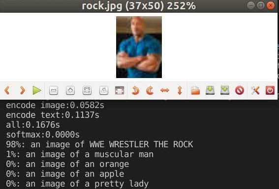
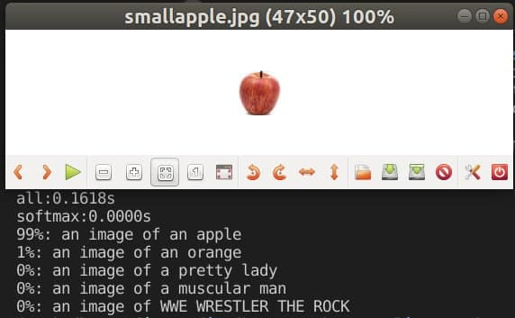

# CLIP for Searching

A simple wrapper around [CLIP](https://github.com/openai/CLIP), inspired from [clifs](https://github.com/johanmodin/clifs).

## Install

```bash
pip install -r requirements.txt
pip install -e .
```

## Usage

### Example

Minimal example

```python
from clip_search.search import ClipSearch

clipsearch = ClipSearch(model_name="RN50")

img_feats = clipsearch.encode_images(images)
text_feats = clipsearch.encode_texts(texts)

probs_text_query = clipsearch.query_with_feats(img_feats, text_feats[0])
```

See [./examples/example.py](./examples/example.py) for more: `cd examples && python example.py`

#### Results

- Prediction on `rock.jpg`
    

- Prediction on `smallapple.jpg`
    

## Test

`python3 -m unittest`
